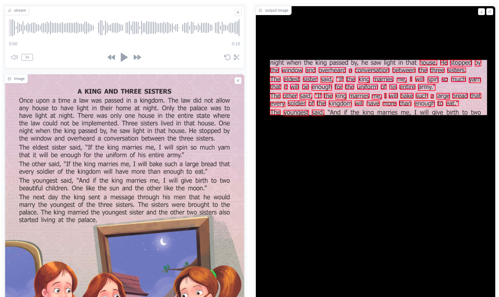
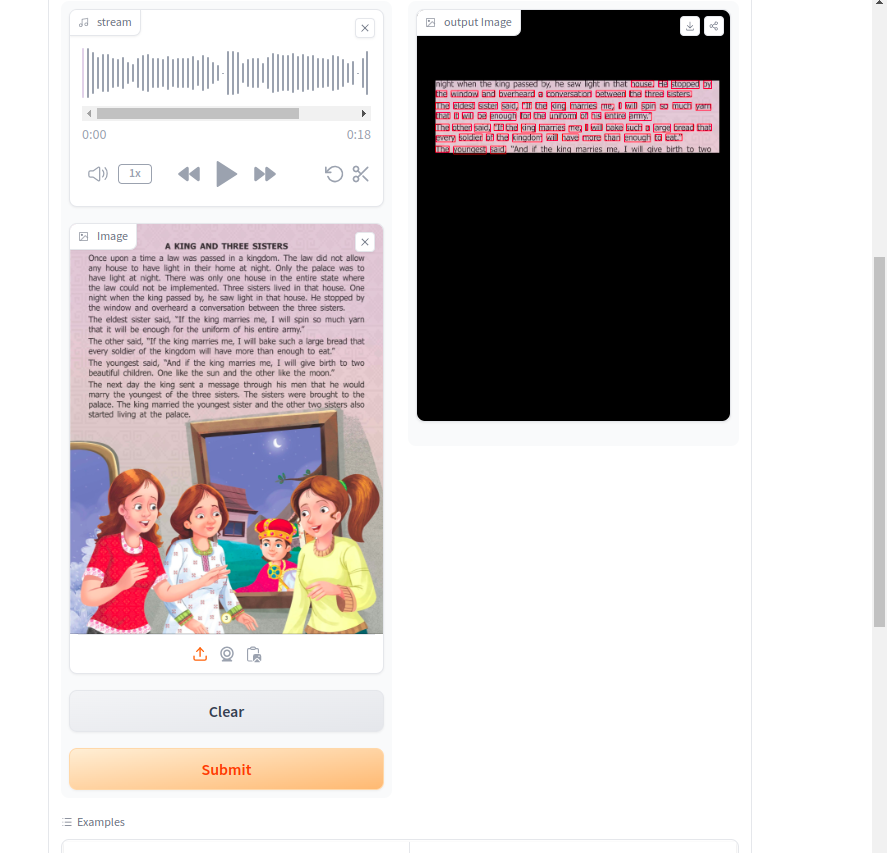
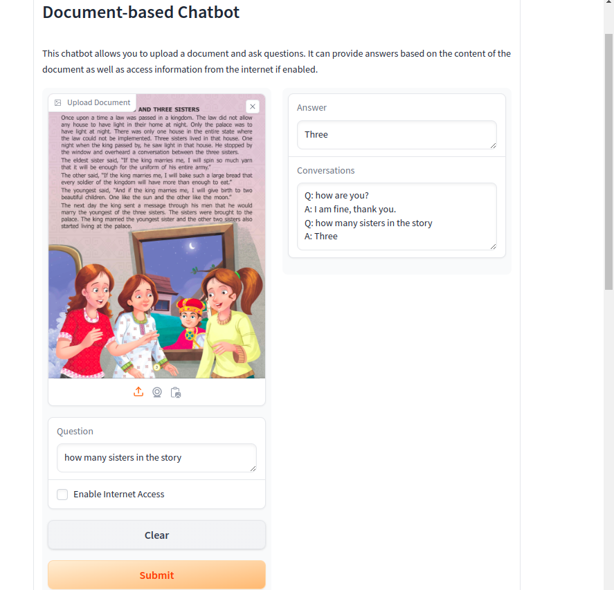

# El Profesor
"El Profissor" aims to revolutionize document interaction and knowledge retrieval by integrating OCR, speech recognition, and chatbot technologies. The project leverages various machine learning techniques, including computer vision, NLP, and audio processing, to support different data types (image, sound, text) within a single application. The project is designed to be user-friendly and accessible to all users, regardless of their technical background.

## Installation
* Clone this repository: `git clone https://github.com/uoch/El_profesor.git`
* Access El_Profesor directory: `cd El_profesor`
* Build the Docker Image: `docker build -t el_profesor .`
* Run the Docker Container:  `docker run -p 7860:7860 -it my_image_name`
* Access the application: `http://localhost:7860/`
- #### Also, you can directly run the app in the Hugging Face space: [El_profesor](https://huggingface.co/spaces/chaouch/El_profesor){:target="_blank"}

## Examples

## Author
Chaouch Thameur - [Github](https://github.com/uoch) - [Hugging Face](https://huggingface.co/chaouch) - [LinkedIn](https://www.linkedin.com/in/thameur-chaouch-8089b813a/)

## License
Public Domain. No copy write protection. 
